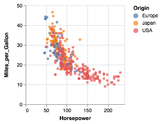

# eve
*Elm - Vega/Lite Integration.*

This library allows you to create Vega-Lite specifications in Elm providing a pure functional interface to declarative visualization construction.

The library does not generate graphical output directly, but instead it allows you to create a JSON _specification_ that can be sent to the Vega-Lite runtime to create the output.
This is therefore a 'pure' Elm package without any external non-Elm dependencies.


## Example

A simple scatterplot encoding engine power and efficiency as x- and y-position and country of origin with colour:

```elm
let
    cars =
        dataFromUrl "data/cars.json" []

    enc =
        encoding
            << position X [ PName "Horsepower", PmType Quantitative ]
            << position Y [ PName "Miles_per_Gallon", PmType Quantitative ]
            << color [ MName "Origin", MmType Nominal ]
in
toVegaLite [ cars, mark Circle [], enc [] ]
```

This generates a JSON specification that when sent to the Vega-Lite runtime produces the following output:



The specification generated by Eve for this example looks like this:

```javascript
{
  "$schema": "https://vega.github.io/schema/vega-lite/v2.json",
  "data": {
    "url": "data/cars.json",
    "format": {
      "type": "json"
    }
  },
  "mark": "circle",
  "encoding": {
    "x": {
      "field": "Horsepower",
      "type": "quantitative"
    },
    "y": {
      "field": "Miles_per_Gallon",
      "type": "quantitative"
    },
    "color": {
      "field": "Origin",
      "type": "nominal"
    }
  }
}
```

For a more thorough set of examples/tutorials, see the [Eve walkthrough](docs/walkthrough/README.md).
