# An elm-vega Walkthrough

This walkthrough will introduce you to the principles and coding style for using elm-vega (or 'Eve' for short) to create interactive visualizations in the [Elm](http://elm-lang.org) language.
It is based on the talk given by [Wongsuphasawat et al at the 2017 Open Vis Conf](https://youtu.be/9uaHRWj04D4).
If you wish to follow along with their talk, timings are given by each section.


## A Grammar of Graphics (0:30)

_elm-vega_ is a wrapper for the [Vega-Lite visualization grammar](https://vega.github.io) which itself is based on Leland Wilkinson's [Grammar of Graphics](http://www.springer.com/gb/book/9780387245447).
The grammar provides an expressive way to define how data are represented graphically.
The six key elements of the original grammar are:


* **Data**: The input to visualize. _Example Eve functions:_ `dataFromUrl`, `dataFromColumns` and `dataFromRows`.
* **Transform**: Functions to change the data before they are visualized. _Example Eve functions:_ `filter`, `calculate` and `bin`.
* **Mark**: The visual symbol(s) that represent the data. _Example Eve types:_ `Line`, `Circle`, `Bar` and `Text`.
* **Encoding**: The specification of which data elements are mapped to which mark characteristics (commonly known as _channels_). _Example Eve functions:_ `position`, `shape`, `size` and `color`.
* **Scale**: Descriptions of the way encoded marks represent the data. _Example Eve types:_ `SDomain`, `SPadding` and `SInterpolate`.
* **Guides**: Supplementary visual elements that support interpreting the visualization. _Example Eve types:_ `Axis` (for position encodings) and `Legend` (for color, size and shape encodings).


In common with other languages that build upon a grammar of graphics such as D3 and Vega, this grammar allows fine grain control of visualization design.
But unlike those languages, Vega-Lite and Eve provide sensible default specifications for most of the grammar, allowing for a much more compact high-level form of expression.


## A Single View specification (3:03)

Let's start with a simple table of data representing time-stamped weather data for Seattle:

| date | precipitation | temp_max | temp_min | wind | weather |
| ---- | ------------- | -------- | -------- | ---- | ------- |
|2012/01/01 | 0.0 | 12.8 | 5.0 | 4.7 | drizzle|
|2012/01/02 | 10.9 | 10.6 | 2.8 | 4.5 | rain|
|2012/01/03 | 0.8 | 11.7 | 7.2 | 2.3 | rain|
| ... | ... | ... | ... | ... | ... |

### A Strip plot (3:26)

We could encode one of the numeric data fields as a _strip plot_ where the horizontal position of a tick mark is determined by the magnitude of the data item (maximum daily temperature in this case):


With elm-vega, we do the following to create this visualization expression:

```elm
toVegaLite
    [ dataFromUrl "data/seattle-weather.csv" []
    , mark Tick []
    , encoding (position X [ PName "temp_max", PmType Quantitative ] [])
    ]
```

Notice how there is no explicit definition of the axis details, color choice or size.
These can be customised, but the default values are designed to follow good practice in visualization design.


The function `toVegaLite` takes a list of grammar specifications and creates a single JSON object that encodes the entire design.
This can be sent to the Vega-Lite runtime to generate the Canvas or SVG output.


Three grammar elements are represented by the three functions `dataFromUrl`, `mark` and `encoding`.


The `encoding` function takes as a single parameter, a list of specifications that are themselves generated by other functions.
In this case we use the function `position` to provide an encoding of the `temp_max` field as the x-position in our plot.
The precise way in which temperature is mapped to the x-position will depend on the type of data we are encoding.
We can provide a hint by delcaring the _measurement type_ of the data field, here `Quantitative` indicating a numeric measurement type.
The final parameter of `position` is a list of any additional encodings in our specification.
Here, with only one encoding, we provide an empty list.


As we build up more complex visualizations we will use many more encodings. To keep the coding clear, the idiomatic way to do this with elm-vega is to chain encoding functions using point-free style.
The example above coded in this way would be

```elm
let
    enc =
        encoding << position X [ PName "temp_max", PmType Quantitative ]
in
toVegaLite
    [ dataFromUrl "data/seattle-weather.csv" []
    , mark Tick []
    , enc []
    ]
```


### Simple Histogram (5:02)

While the strip plot shows the range of temperatures, it is hard to see how many days have which temperatures. To see that, we need to show the distribution more explicitly. We can do this by _binning_ the temperatures and then aggregating the data in each bin into counts. If we encode those counts by the y-position and change our mark from _tick_ to _bar_ we have our frequency histogram:


```elm
let
    enc =
        encoding
            << position X [ PName "temp_max", PmType Quantitative, PBin [] ]
            << position Y [ PAggregate Count, PmType Quantitative ]
in
toVegaLite
    [ dataFromUrl "data/seattle-weather.csv" []
    , mark Bar []
    , enc []
    ]
```

The code now contains two chained `position` encodings: one for the x-position, which is now binned, and one for the y-position which is aggregated by providing `PAggregate Count` instead of a data field name.

Notice again that sensible defaults are provided for the parts of the specification we didn't specify such as axis titles, colors and number of bins.


### Stacked Histogram (7:03)

Position isn't the only channel we can use to encode data.
Color is an important channel in many visualizations, so we can use it here to encode the dominant weather type for each date in our table.
The overall shape of the histogram is the same, but now can get some idea of the separate distributions for each of the recorded weather types.


```elm
let
    enc =
        encoding
            << position X [ PName "temp_max", PmType Quantitative, PBin [] ]
            << position Y [ PAggregate Count, PmType Quantitative ]
            << color [ MName "weather", MmType Nominal ]
in
toVegaLite
    [ dataFromUrl "data/seattle-weather.csv" []
    , mark Bar []
    , enc []
    ]
```

The code to do this simply adds another channel encoding, this time `color` rather than `position`, and uses it to encode the `weather` data field.
Unlike temperature, weather type is _nominal_, that is, categorical with no intrinsic order.
And once again, simply by declaring the measurement type, Vega-Lite determines an appropriate color scheme and legend.

Notice how that with elm-vega we make frequent use of _union types_ (always indicated by names starting with an uppercase letter).
Types used to customise various channels all start with an uppercase letter indicating the type of channel affected.
So the name of the data field use to encode _position_ is `PName`, its measurement type, `PmType`  and its positional aggregation is `PAggregate`, whereas the name of the data field for encoding color is indicated by `MName` and its measurement type `MmType` (where `M` is short for _mark_).

### Stacked Histogram with Customised Colors (7:20)


While the default nominal color scheme is well chosen for general purposes, we might want to customise the colors to better match the semantics of the data.


Changing the way a channel is encoded involves specifying the _scale_ and in particular the mapping between the _domain_ (the elements of the data to show) and the color _range_ used to represent them.


```elm
weatherColors : List ScaleProperty
weatherColors =
    categoricalDomainMap
        [ ( "sun", "#e7ba52" )
        , ( "fog", "#c7c7c7" )
        , ( "drizzle", "#aec7ea" )
        , ( "rain", "#1f77b4" )
        , ( "snow", "#9467bd" )
        ]
let
    enc =
        encoding
            << position X [ PName "temp_max", PmType Quantitative, PBin [] ]
            << position Y [ PAggregate Count, PmType Quantitative ]
            << color [ MName "weather", MmType Nominal, MScale weatherColors ]
in
toVegaLite
    [ dataFromUrl "data/seattle-weather.csv" []
    , mark Bar []
    , enc []
    ]
```

The mapping between the values in the domain (weather types `sun`, `fog` etc.) and the colors used to represent them (hex values `#e7ba52`, `#c7c7c7` etc.) is handled by an elm-vega function `categoricalDomainMap` which accepts a list of tuples defining those mappings.

Notice how we never needed to state explicitly that we wished our bars to be stacked.
This was reasoned directly by Vega-Lite based on the combination of bar marks and color channel encoding.
If we were to change just the mark type from `Bar` to `Line`, Vega-Lite produces an unstacked series of lines, which makes sense because unlike bars, lines do not occlude one another to the same extent.


```elm
let
    enc =
        encoding
            << position X [ PName "temp_max", PmType Quantitative, PBin [] ]
            << position Y [ PAggregate Count, PmType Quantitative ]
            << color [ MName "weather", MmType Nominal, MScale weatherColors ]
in
toVegaLite
    [ dataFromUrl "data/seattle-weather.csv" []
    , mark Line []
    , enc []
    ]
```

The stacked bar chart version is better at showing the overall distribution of all weather types but it is more difficult to compare distributions of anything other than sun as all other weather types lack a common baseline.
To compare distributions of all categories we can move from a single view to a multi-view composition.


## Layered and Multi-view Composition (8:28)

To show our weather distributions next to each other rather than stacked on top of each other, we simply encode column position in a row of small multiples to the `weather` data field:


```elm
let
    enc =
        encoding
            << position X [ PName "temp_max", PmType Quantitative, PBin [] ]
            << position Y [ PAggregate Count, PmType Quantitative ]
            << color [ MName "weather", MmType Nominal, MLegend [], MScale weatherColors ]
            << column [ FName "weather", FmType Nominal ]
in
toVegaLite
    [ dataFromUrl "data/seattle-weather.csv" []
    , mark Bar []
    , enc []
    ]
```
There are only two additions in order to create these small multiples.
Firstly we have an extra encoding with the `column` function specifying the `weather` data field as the one to determine which column each data item gets mapped to.
Note that the `F` prefix for `FName` and `FmType` refers to _facet_ – a form of data selection and grouping standard in data visualization.


The second, minor change, is to include an `MLegend` specification in the color encoding. The legend can be customised with its parametmer list but here by providing an empty list, we declare we do not wish the default legend to appear (the arrangement into columns with color encoding and default column labels make the legend redundant).

### Multi-view Composition Operators (9:00)

There are four ways in which multiple views may be combined:

* The **facet operator** takes subsets of a dataset (facets) and separately applies the same view specification to each of those facets (as seen with the `column` function above).
Eve functions to create faceted views: `column`, `row`, `facet` and `specification`.

* The **layer operator** creates different views of the data but each is layered (superposed) on the same same space, for example a trend line layered on top of a scatterplot.
Eve functions to create a layered view: `layer` and `asSpec`.

* The **concatenation operator** allows arbitrary views (potentially with different datasets) to be assembled in rows or columns.
This allows 'dashboards' to be built.
Eve functions to create concatenated views: `vConcat`, `hConcat` and `asSpec`.

* The **repeat operator** is a concise way of combining multiple views with only small data-driven differences in each view.
Eve functions for repeated views: `repeat` and `specification`.

## Composition Example: Precipitation in Seattle (9:40)

As a basis for discussing view composition, let's start with a single bar chart showing monthly precipitation in Seattle:


```elm
let
    enc =
        encoding
            << position X [ PName "date", PmType Ordinal, PTimeUnit Month ]
            << position Y [ PName "precipitation", PmType Quantitative, PAggregate Mean ]
in
toVegaLite
    [ dataFromUrl "data/seattle-weather.csv" []
    , mark Bar []
    , enc []
    ]
```

(Note that here we've cast the date, which has been quantized into monthly intervals, to be ordinal so that bars span the full width of each month.)

### Composing layers (10:08)

We can annotate the chart by placing the bar chart specification in a _layer_ and adding another layer with the annotation.
In this example we will add a layer showing the average precipitation for the entire period:


```elm
let
    barEnc =
        encoding
            << position X [ PName "date", PmType Ordinal, PTimeUnit Month ]
            << position Y [ PName "precipitation", PmType Quantitative, PAggregate Mean ]

    barSpec =
        asSpec [ mark Bar [], barEnc [] ]

    avLineEnc =
        encoding
            << position Y [ PName "precipitation", PmType Quantitative, PAggregate Mean ]

    avLineSpec =
        asSpec [ mark Rule [], avLineEnc [] ]
in
toVegaLite
    [ dataFromUrl "data/seattle-weather.csv" []
    , layer [ barSpec, avLineSpec ]
    ]
```

The bar encoding is exactly as it was previously, but this time instead of passing it directly to `toVegaLite` we store it in its own specification object with `asSepc` (which we called `barSpec` in the example above).
We add a similar average line specification but only need to encode the y-position as we wish to span the entire chart space with the `rule` mark.
The two specifications are combined as layers with the `layer` function which we add to the list of specifications passed to `toVegaLite` in place of the original bar specification.

### Concatenating views (10:47)

Instead of layering one view on top of another (superposition), we can place them side by side in a row or column (juxtaposition). In Vega-Lite this is referred to as _concatenation_:


```elm
let
    bar1Enc =
        encoding
            << position X [ PName "date", PmType Ordinal, PTimeUnit Month ]
            << position Y [ PName "precipitation", PmType Quantitative, PAggregate Mean ]

    bar1Spec =
        asSpec [ mark Bar [], bar1Enc [] ]

    bar2Enc =
        encoding
            << position X [ PName "date", PmType Ordinal, PTimeUnit Month ]
            << position Y [ PName "temp_max", PmType Quantitative, PAggregate Mean ]

    bar2Spec =
        asSpec [ mark Bar [], bar2Enc [] ]
in
toVegaLite
    [ dataFromUrl "data/seattle-weather.csv" []
    , vConcat [ bar1Spec, bar2Spec ]
    ]
```

Concatenated views are specified in the same way as layered views expect that we use the `vConcat` function (or `hConcat` for a horizontal arrangement) in place of `layer`.

### Repeated Views (11:08)

Noting that juxtaposing similar charts is a common operation, and the specification for each of them often is very similar, the repeat operator allows us to streamline the specification required to do this.
We might, for example, wish to show three data fields from the Seattle weather dataset:


```elm
let
    enc =
        encoding
            << position X [ PName "date", PmType Ordinal, PTimeUnit Month ]
            << position Y [ PRepeat Row, PmType Quantitative, PAggregate Mean ]

    spec =
        asSpec [ dataFromUrl "data/seattle-weather.csv" [], mark Bar [], enc [] ]
in
toVegaLite
    [ repeat [ RowFields [ "precipitation", "temp_max", "wind" ] ]
    , specification spec
    ]
```

This more compact specification replaces the data field name (`PName "precipitation"` etc.) with a reference to the repeating field (`PRepeat`) either as a `Row` or `Column` depending on the desired layout. We then compose the specifications by providing a set of `RowFields` (or `ColumnFields`) containing a list of the fields to which we wish to apply the specification (identified with the function `specification` which should follow the `repeat` function provided to `toVegaLite`).

We can combine repeated rows and repeated columns to create a grid of views, such as a scatterplot matrix (or SPLOM for short):


```elm
let
    enc =
        encoding
            << position X [ PRepeat Column, PmType Quantitative ]
            << position Y [ PRepeat Row, PmType Quantitative ]

    spec =
        asSpec [ dataFromUrl "data/seattle-weather.csv" [], mark Point [], enc [] ]
in
toVegaLite
    [ repeat
        [ RowFields [ "temp_max", "precipitation", "wind" ]
        , ColumnFields [ "wind", "precipitation", "temp_max" ]
        ]
    , specification spec
    ]
```

### Building A Dashboard (12:40)

We can compose more complex 'dashboards' by assembling single views but varying either their encoding or the data that is encoded. To illustrate, let's first identify the four single view types that we will compose with (all of these we have considered above, but are shown here again for clarity).

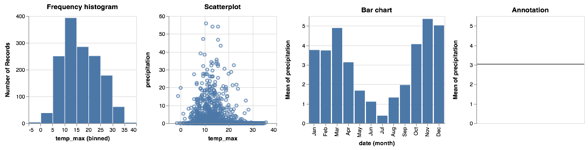

As we have seen, we can arrange combinations of these views with the composition operators _layer_, _facet_, _repeat_ and _concatenate_. The specifications that result can themselves be further composed with the same operators to form a tree of compositions:


This allows us to create a nested dashboard of views:

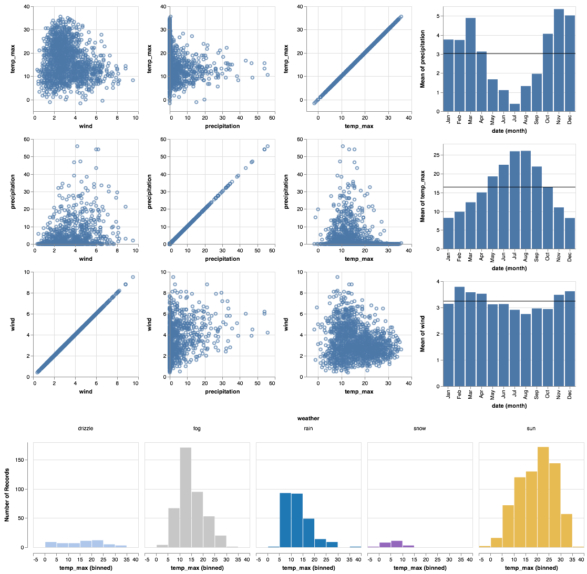

```elm
let
    histoEnc =
        encoding
            << position X [ PName "temp_max", PmType Quantitative, PBin [] ]
            << position Y [ PAggregate Count, PmType Quantitative ]
            << color [ MName "weather", MmType Nominal, MLegend [], MScale weatherColors ]
            << column [ FName "weather", FmType Nominal ]

    histoSpec =
        asSpec [ mark Bar [], histoEnc [] ]

    scatterEnc =
        encoding
            << position X [ PRepeat Column, PmType Quantitative ]
            << position Y [ PRepeat Row, PmType Quantitative ]

    scatterSpec =
        asSpec [ mark Point [], scatterEnc [] ]

    barEnc =
        encoding
            << position X [ PName "date", PmType Ordinal, PTimeUnit Month ]
            << position Y [ PRepeat Row, PmType Quantitative, PAggregate Mean ]

    annotationEnc =
        encoding
            << position Y [ PRepeat Row, PmType Quantitative, PAggregate Mean ]

    layerSpec =
        asSpec
            [ layer
                [ asSpec [ mark Bar [], barEnc [] ]
                , asSpec [ mark Rule [], annotationEnc [] ]
                ]
            ]

    barsSpec =
        asSpec
            [ repeat [ RowFields [ "precipitation", "temp_max", "wind" ] ]
            , specification layerSpec
            ]

    splomSpec =
        asSpec
            [ repeat
                [ RowFields [ "temp_max", "precipitation", "wind" ]
                , ColumnFields [ "wind", "precipitation", "temp_max" ]
                ]
            , specification scatterSpec
            ]
in
toVegaLite
    [ dataFromUrl "data/seattle-weather.csv" []
    , vConcat
        [ asSpec [ hConcat [ splomSpec, barsSpec ] ]
        , histoSpec
        ]
    ]
```

There is nothing new in this example – we have simply assembled a range of views with the composition operators.
It is worth noting that the data source (`seattle-weather.csv`) need only be identified once so can be removed from the component view specifications.
This has the advantage that if we were to replace the reference to the data file with another, we only need do it once.
Here, for example is exactly the same specification but with `newYork-weather` given as the data source.

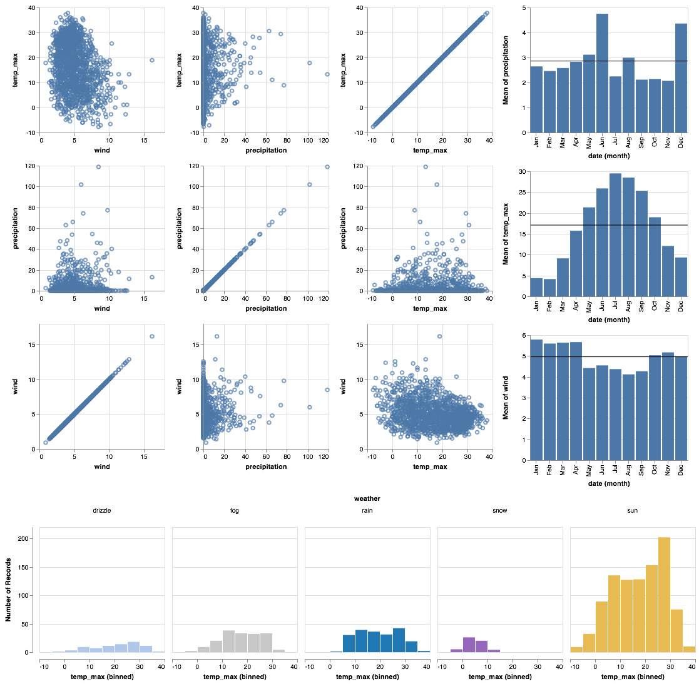

It would be trivial to concatenate these two specifications to allow a Seattle – New York comparison dashboard to be created.

## Interaction (14:35)

Interaction is enabled by creating _selections_ that may be combined with the kinds of specifications already described.
Selections involve three components:

* **Events** are those actions that trigger the interaction such as clicking at a location on screen or pressing a key.

* **Points of interest** are the elements of the visualization with which the interaction occurs, for example, a set of points selected on a scatterplot.

* **Predicates** (i.e. Boolean functions) identify whether or not something is included in the selection. These need not be limited to only those parts of the visualization directly selected through interaction (see _selection projection_ below).

By way of an example consider this colored scatterplot where any point can be selected and all non-selected points are turned grey (_see [examples/walkthrough.html](../../examples/walkthrough.html) for the interactive version of the visualization; below a click is symbolised by the highlighting circle._):

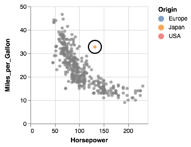

```elm
let
    enc =
        encoding
            << position X [ PName "Horsepower", PmType Quantitative ]
            << position Y [ PName "Miles_per_Gallon", PmType Quantitative ]
            << color
                [ MCondition "picked"
                    [ MName "Origin", MmType Nominal ]
                    [ MString "grey" ]
                ]

    sel =
        selection
            << select "picked" Single []
in
toVegaLite
    [ dataFromUrl "data/cars.json" []
    , mark Circle []
    , enc []
    , sel []
    ]
```

In comparison to the static specifications we have already seen, the addition here is the new function `selection` that is added to the spec passed to Vega-Lite and a new `MCondition` used to encode color.

Previously when encoding color (or any other channel) we have provided a list of properties.
Here we provide a pair of lists – one for when the selection condition is true, the other for when it is false.

The name `"picked"` is just one we have chosen to call the selection.
The type of selection here is `Single` meaning we can only select one item at a time.

Because we will reuse the scatterplot specification in several examples, we can declare the basic specification in its own Elm function:

```elm
scatterProps : List ( VLProperty, Spec )
scatterProps =
    let
        enc =
            encoding
                << position X [ PName "Horsepower", PmType Quantitative ]
                << position Y [ PName "Miles_per_Gallon", PmType Quantitative ]
                << color
                    [ MCondition "picked"
                        [ MName "Origin", MmType Nominal ]
                        [ MString "grey" ]
                    ]
    in
    [ dataFromUrl "data/cars.json" [], mark Circle [], enc [] ]
```

This allows us to add the selection specification separately.
So the previous example can now be created by adding the selection function and passing the complete list to `toVegaLite`

```elm
let
    sel =
        selection
            << select "picked" Single []
in
toVegaLite <| sel [] :: scatterProps
```


To select multiple points by shift-clicking, we use `Multi` instead of 'Single' in the `selection`:

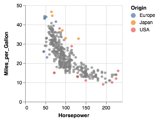

```elm
let
    sel =
        selection
            << select "picked" Multi []
in
toVegaLite <| sel [] :: scatterProps
```

Alternatively, we could make the selection happen based on any browser event by parameterising `select` with the type `On` and a value matching a JavaScript event name, such as mouse movement over points to give more of a paintbrush effect:

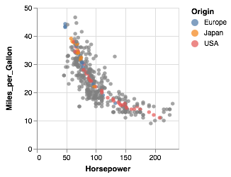

```elm
let
    sel =
        selection
            << select "picked" Multi [On "mouseover"]
in
toVegaLite <| sel [] :: scatterProps
```

### Selection Transformations (16:39)

Simple selections as described above create sets of selected data marks based directly on what was interacted with by the user.
Selection transformations allow us to _project_ that direct selection onto other parts of our dataset.
For example, suppose we wanted to know what effect the number of engine cylinders has on the relationship between engine power and engine efficiency.
We can invoke a _selection projection_ on `Cylinders` in our dataset that says 'when a single point is selected, extend that selection to all other points in the dataset that share the same number of cylinders':

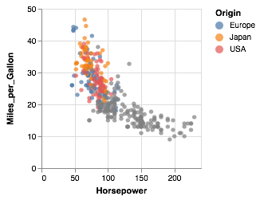

```elm
let
    sel =
        selection
            << select "picked" Single [ Empty, Fields [ "Cylinders" ] ]
in
toVegaLite <| sel [] :: scatterProps
```

This is invoked simply by adding a parameterised `Fields` type to the `select` parameters naming the fields onto which we wish to project our selection.
Additionally, we have set the default selection to `Empty` here so that if nothing is selected, the selection is empty (without this the default selection is the entire encoded dataset.)


Selection need not be limited to direct interaction with the visualization marks.
We can also _bind_ the selection to other user-interface components.
For example we could select all those cars with a chosen number of cylinders with a slider by binding the selection to an HTML _input range_ component.
Clicking on a point projects the selection as before, but also updates the slider; moving the slider updates the selected points:

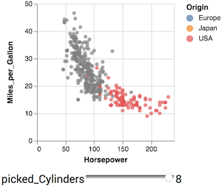

```elm
let
    sel =
        selection
            << select "picked"
                Single
                [ Fields [ "Cylinders" ]
                , Bind [ IRange "Cylinders" [ InMin 3, InMax 8, InStep 1 ] ]
                ]
in
toVegaLite <| sel [] :: scatterProps
```
The binding to the slider is added with the parameterised `Bind` type followed by a type representing the HTML input element (`IRange` in this example), the data field to which it is to be bound and then a list of optional input element parameters (here just setting the limits of the slider and step between slider values).
The binding is two-way, so directly selecting points on the scatterplot updates the sliders and moving the sliders updates the selected (and therefore highlighted) points.

Binding need not be limited to single input element.
We could, for example, bind another input slider to the year of manufacture to see if there are any trends in engine efficiency over time.
Here the selection projection matches both number of cylinders and year of manufacture either selected by clicking on a mark or adjusting the sliders:


```elm
let
    sel =
        selection
            << select "picked"
                Single
                [ Fields [ "Cylinders", "Year" ]
                , Bind
                    [ IRange "Cylinders" [ InMin 3, InMax 8, InStep 1 ]
                    , IRange "Year" [ InMin 1969, InMax 1981, InStep 1 ]
                    ]
                ]
in
toVegaLite <| sel [] :: scatterProps
```

The `Interval` selection type is useful for rapidly choosing a region of a view.
Simply providing an unparameterised selection allows both the width and the height of the selection to be chosen:

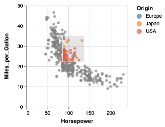

```elm
let
    sel =
        selection
            << select "picked" Interval []
in
toVegaLite <| sel [] :: scatterProps
```

Projecting the selection onto a position channel can be used to select all marks that have an X- or Y- position within a region regardless of the other spatial coordinate:

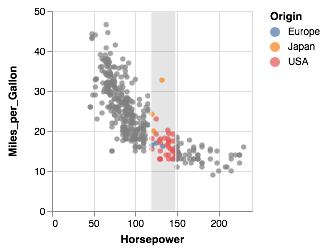

```elm
let
    sel =
        selection
            << select "picked" Interval [ Encodings [ ChX ] ]
in
toVegaLite <| sel [] :: scatterProps
```

Notice here that to project the selection we parameterise `Interval` not with a field name as we have done previously but with a channel encoding using the union type `Encodings` (here parameterised with the X-position channel `ChX`).

If we further _bind_ that selection to the _scale_ transformation of X-position, we have created the ability to pan and zoom the view as the scaling is determined interactively depending on the extent and position of the interval selection:


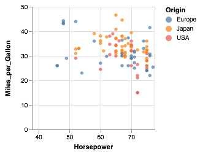
```elm
let
    sel =
        selection
            << select "picked" Interval [ Encodings [ ChX ], BindScales ]
in
toVegaLite <| sel [] :: scatterProps
```

### Multiple Coordinated Views (19:38)

One of the more powerful aspects of selection-based interaction is in coordinating different views – a selection of a data subset is projected onto all other views of the same data:


```elm
let
    enc =
        encoding
            << position X [ PRepeat Column, PmType Quantitative ]
            << position Y [ PRepeat Row, PmType Quantitative ]
            << color
                [ MCondition "picked"
                    [ MName "Origin", MmType Nominal ]
                    [ MString "grey" ]
                ]

    sel =
        selection
            << select "picked" Interval [ Encodings [ ChX ] ]

    spec =
        asSpec [ dataFromUrl "data/cars.json" [], mark Circle [], enc [], sel [] ]
in
toVegaLite
    [ repeat
        [ RowFields [ "Displacement", "Miles_per_Gallon" ]
        , ColumnFields [ "Horsepower", "Miles_per_Gallon" ]
        ]
    , specification spec
    ]
```

There is nothing new in the specification here other than combining the `repeat` function with the `selection`.
The selection is projected across all views as it is duplicated by the `repeat` operator.

It is a simple step to bind the scales of the scatterplots in the same way to coordinate zooming and panning across views:


```elm
let
    enc =
        encoding
            << position X [ PRepeat Column, PmType Quantitative ]
            << position Y [ PRepeat Row, PmType Quantitative ]
            << color [ MName "Origin", MmType Nominal ]

    sel =
        selection
            << select "picked" Interval [ BindScales ]

    spec =
        asSpec [ dataFromUrl "data/cars.json" [], mark Circle [], enc [], sel [] ]
in
toVegaLite
    [ repeat
        [ RowFields [ "Displacement", "Miles_per_Gallon" ]
        , ColumnFields [ "Horsepower", "Miles_per_Gallon" ]
        ]
    , specification spec
    ]
```

The only difference between this and the previous example is that we now `BindScales` based on the selection rather than provide a conditional encoding of color.

The ability to determine the scale of a chart based on a selection is useful in implementing a common visualization design pattern, that of 'context and focus' (or sometimes referred to as 'overview and detail on demand').
We can achieve this by setting the scale of one view based on the selection in another.
The detail view is updated whenever the selected region is changed through interaction:

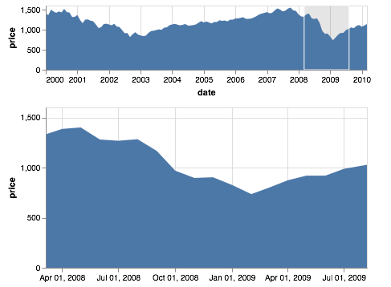
```elm
let
    sel =
        selection << select "brush" Interval [ Encodings [ ChX ] ]

    encContext =
        encoding
            << position X [ PName "date", PmType Temporal, PAxis [ Format "%Y" ] ]
            << position Y
                [ PName "price"
                , PmType Quantitative
                , PAxis [ TickCount 3, Grid False ]
                ]

    specContext =
        asSpec [ width 400, height 80, sel [], mark Area [], encContext [] ]

    encDetail =
        encoding
            << position X
                [ PName "date"
                , PmType Temporal
                , PScale [ SDomain (DSelection "brush") ]
                , PAxis [ AxTitle "" ]
                ]
            << position Y [ PName "price", PmType Quantitative ]

    specDetail =
        asSpec [ width 400, mark Area [], encDetail [] ]
in
toVegaLite
    [ dataFromUrl "data/sp500.csv" []
    , vConcat [ specContext, specDetail ]
    ]
```

### Cross-filtering (20:41)

The final example brings together ideas of view composition and interactive selection with data filtering by implementing _cross-filtering_.

A cross-filter involves selecting a subset of the data in one view and then only displaying those data in other views.
In this example we use `repeat` to show three fields in a flights database – hour of day in which a flight departs, the distribution of flight delays and the distribution of flight distances. By selecting a subset of any one of those views, we overlay a layer in a gold color of just those selected flights for all three fields:

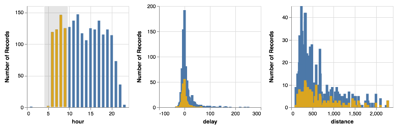
```elm
let
    hourTrans =
        -- This generates a new field based on the hour of day extracted from the date field.
        transform
            << calculate "hours(datum.date)" "hour"

    sel =
        selection << select "brush" Interval [ Encodings [ ChX ] ]

    filterTrans =
        transform
            << filter (FSelection "brush")

    totalEnc =
        encoding
            << position X [ PRepeat Column, PmType Quantitative ]
            << position Y [ PAggregate Count, PmType Quantitative ]

    selectedEnc =
        encoding
            << position X [ PRepeat Column, PmType Quantitative ]
            << position Y [ PAggregate Count, PmType Quantitative ]
            << color [ MString "goldenrod" ]
in
toVegaLite
    [ repeat [ ColumnFields [ "hour", "delay", "distance" ] ]
    , specification <|
        asSpec
            [ dataFromUrl "data/flights-2k.json" [ Parse [ ( "date", FoDate "%Y/%m/%d %H:%M" ) ] ]
            , hourTrans []
            , layer
                [ asSpec [ mark Bar [], totalEnc [] ]
                , asSpec [ sel [], filterTrans [], mark Bar [], selectedEnc [] ]
                ]
            ]
    ]
```
