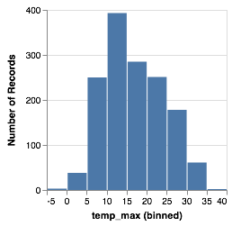
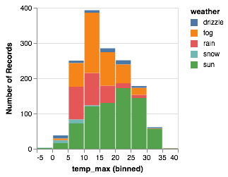
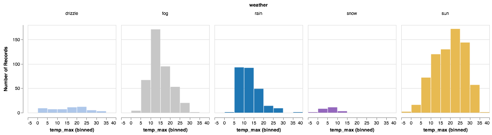
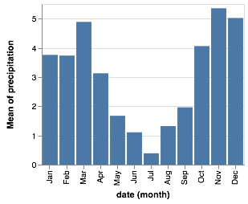
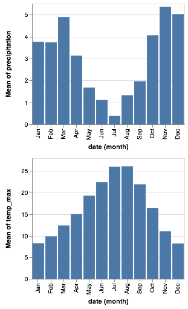
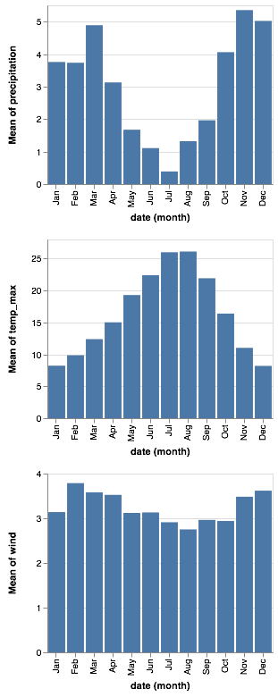

# An Eve Walkthrough

This walkthrough will introduce you to the principles and coding style for using Eve to create interactive visualizations in the [Elm](http://elm-lang.org) language.
It is based on the talk given by [Wongsuphasawat et al at the 2017 Open Vis Conf](https://youtu.be/9uaHRWj04D4).
If you wish to follow along with their talk, timings are given by each section.


## A Grammar of Graphics (0:30)

Eve is a wrapper for the [Vega-Lite visualization grammar](https://vega.github.io) which itself is based on Leland Wilkinson's [Grammar of Graphics](http://www.springer.com/gb/book/9780387245447).
The grammar provides an expressive way to define how data are represented graphically.
The six key elements of that grammar are


* **Data**: The input to visualize. _Example Eve functions:_ `dataFromUrl`, `dataFromColumns`.
* **Transform**: Functions to change the data before they are visualized. _Example Eve functions:_ `filter`, `calculate`, `bin`.
* **Mark**: The visual symbol(s) that represent the data. _Example Eve types:_ `Line`, `Circle`, `Bar`.
* **Encoding**: The specification of which data elements are mapped to which mark characteristics (known as _channels_). _Example Eve functions:_ `position`, `shape`, `size`.
* **Scale**: Descriptions of the way encoded marks represent the data. _Example Eve types:_ `SDomain`, `SPadding`, `SInterpolate`.
* **Guides**: Supplementary visual elements that support interpreting the visualization. _Example Eve types:_ `Axis`, `Legend`.


In common with other languages that build upon a grammar of graphics such as D3 and Vega, this grammar allows fine grain control of visualization design.
But unlike those languages, Vega-Lite and Eve provide sensible default specifications for most of the grammar, allowing for a much more compact high-level form of expression.


## A Single View specification (3:03)˜

Let's start with a simple table of data representing time-stamped weather data for Seattle:

| date | precipitation | temp_max | temp_min | wind | weather |
| ---- | ------------- | -------- | -------- | ---- | ------- |
|2012/01/01 | 0.0 | 12.8 | 5.0 | 4.7 | drizzle|
|2012/01/02 | 10.9 | 10.6 | 2.8 | 4.5 | rain|
|2012/01/03 | 0.8 | 11.7 | 7.2 | 2.3 | rain|
| ... | ... | ... | ... | ... | ... |

### A Strip plot (3:26)

We could encode one of the numeric data fields as a _strip plot_ where the horizontal position of a tick mark is determined by the magnitude of the data item:


In Eve, to create this visualization expression:

```elm
toVegaLite
    [ dataFromUrl "data/seattle-weather.csv" []
    , mark Tick []
    , encoding (position X [ PName "temp_max", PmType Quantitative ] [])
    ]
```

Notice how there is no explicit definition of the axis details, colour choice or size.
These can be customised, but the default values are designed to follow good practice in visualization design.


The function `toVegaLite` takes a list of grammar specifications and creates a single JSON object that encodes the entire design.
This can be sent to the Vega-Lite runtime to generate the Canvas or SVG output.


Three grammar elements are represented by the three functions `dataFromUrl`, `mark` and `encoding`.


The `encoding` function takes as a single parameter, a list of specifications that are themselves generated by other functions.
In this case we use the function `position` to provide an encoding of the `temp_max` field to the x-position in our plot.
The precise way in which temperature is mapped to the x-position will depend on the type of data we are encoding.
We can provide a clue as to how that might occur by identifying the _measurement type_ of the data field, here `Quantitative` indicating a numeric measurement type.
The final parameter of `position` is a list of any other encodings in our specification.
Here, with only one encoding, we provide an empty list.


As we build up more complex visualizations we will use many more encodings. To keep the coding clear, the idiomatic way to do this in Eve is to chain encoding functions using point-free style. The example above coded in this way would be

```elm
let
    enc =
        encoding << position X [ PName "temp_max", PmType Quantitative ]
in
toVegaLite
    [ dataFromUrl "data/seattle-weather.csv" []
    , mark Tick []
    , enc []
    ]
```


### Simple Histogram (5:02)

While the strip plot shows the range of temperatures, it is hard to see how many days have which temperatures. To see that, we need to show the distribution more explicitly. We can do this by _binning_ the temperatures and then aggregating the data in each bin into counts. If we encode those counts by the y-position and change our mark from _tick_ to _bar_ we have our frequency histogram:



```elm
let
    enc =
        encoding
            << position X [ PName "temp_max", PmType Quantitative, PBin [] ]
            << position Y [ PAggregate Count, PmType Quantitative ]
in
toVegaLite
    [ dataFromUrl "data/seattle-weather.csv" []
    , mark Bar []
    , enc []
    ]
```

The Eve code now contains two chained `position` encodings: one for the x-position, which is now binned, and one for the y-position which is aggregated by providing `PAggregate Count` instead of a data field name.

Notice again that sensible defaults are provided for the parts of the specification we didn't specify such as axis titles, colours and number of bins.


### Stacked Histogram (7:03)

Position isn't the only channel we can use to encode data.
Colour is an important channel in many visualizations, so we can use it here to encode the dominant weather type for each date in our table.
The overall shape of the histogram is the same, but now can get some idea of the separate distributions for each of the recorded weather types.



```elm
let
    enc =
        encoding
            << position X [ PName "temp_max", PmType Quantitative, PBin [] ]
            << position Y [ PAggregate Count, PmType Quantitative ]
            << color [ MName "weather", MmType Nominal ]
in
toVegaLite
    [ dataFromUrl "data/seattle-weather.csv" []
    , mark Bar []
    , enc []
    ]
```

The Eve code to do this is simply to add another channel encoding, this time `color` rather than `position`, and use it to encode the `weather` data field.
Unlike temperature, weather type is _nominal_, that is, categorical with no intrinsic order.
And once again, simply by stating the measurement type, Vega-Lite determines an appropriate colour scheme and legend.

Notice how that in Eve we make frequent use of _union types_ (always indicated by names starting with an uppercase letter).
Types used to customise various channels all start with an uppercase letter indicating the type of channel affected.
So the name of the data field use to encode _position_ is `PName`, its measurement type, `PmType`  and its positional aggregation is `PAggregate`, whereas the name of the data field for encoding colour is indicated by `MName` and its measurement type `MmType` (where `M` is short for Mark).

### Stacked Histogram with Customised Colours (7:20)


While the default nominal colour scheme is well chosen for general purposes, we might want to customise the colours to better match the semantics of the data.


Changing the way a channel is encoded involves specifying the _scale_ and in particular the mapping between the _domain_ (the elements of the data to show) and the colour _range_ used to represent them.


```elm
weatherColors : List ScaleProperty
weatherColors =
    categoricalDomainMap
        [ ( "sun", "#e7ba52" )
        , ( "fog", "#c7c7c7" )
        , ( "drizzle", "#aec7ea" )
        , ( "rain", "#1f77b4" )
        , ( "snow", "#9467bd" )
        ]
let
    enc =
        encoding
            << position X [ PName "temp_max", PmType Quantitative, PBin [] ]
            << position Y [ PAggregate Count, PmType Quantitative ]
            << color [ MName "weather", MmType Nominal, MScale weatherColors ]
in
toVegaLite
    [ dataFromUrl "data/seattle-weather.csv" []
    , mark Bar []
    , enc []
    ]
```

The mapping between the values in the domain (weather types `sun`, `fog` etc.) and the colors used to represent them (hex values `#e7ba52`, `#c7c7c7` etc.) is handled by an Eve function `categoricalDomainMap` which accepts a list of tuples defining those mappings.

Notice how we never needed to state explicitly that we wished our bars to be stacked.
This was inferred directly by Vega-Lite based on the combination of bar marks and colour channel encoding.
If we were to change just the mark type from `Bar` to `Line`, Vega-Lite now produces an unstacked series of lines, which makes sense because unlike bars, lines do not occlude one another to the same extent.


```elm
let
    enc =
        encoding
            << position X [ PName "temp_max", PmType Quantitative, PBin [] ]
            << position Y [ PAggregate Count, PmType Quantitative ]
            << color [ MName "weather", MmType Nominal, MScale weatherColors ]
in
toVegaLite
    [ dataFromUrl "data/seattle-weather.csv" []
    , mark Line []
    , enc []
    ]
```

The stacked bar chart version is better at showing the overall distribution of all weather types but more difficult to to compare distributions of anything other than sun as all other weather types lack a common baseline.
To compare distributions of all categories we can move from a single view to a multi-view composition.


## Layered and Multi-view Composition (8:28)

To show our weather distributions next to each other rather than stacked on top of each other, we simply encode column position in a row of small multiples to the weather data field:



```elm
let
    enc =
        encoding
            << position X [ PName "temp_max", PmType Quantitative, PBin [] ]
            << position Y [ PAggregate Count, PmType Quantitative ]
            << column [ FName "weather", FmType Nominal ]
            << color [ MName "weather", MmType Nominal, MLegend [], MScale weatherColors ]
in
toVegaLite
    [ dataFromUrl "data/seattle-weather.csv" []
    , mark Bar []
    , enc []
    ]
```
There are only two additions to the Eve specification to create these small multiples.
Firstly we have an extra encoding with the `column` function specifying the `weather` data field as the one to determine which column each data item gets mapped to.
Note that the `F` prefix for `FName` and `FmType` refers to _facet_ – a form of data selection and grouping standard in data visualization.


The second, minor change, is to include an `MLegend` specification in the colour encoding, but here by providing an empty list, we are stating we do not wish the default legend to appear (the arrangement into columns with colour encoding and default column labels make the legend redundant).

### Multi-view Composition Operators (9:00)

There are four ways in which multiple views may be combined:

* The **facet operator** takes subsets of a dataset and separately applies the same view specification to each of those facets (as seen with the `column` function above).
Eve functions to create faceted views: `column`, `row`, `facet` and `specification`.

* The **layer operator** creates different views of the data but each is layered (superposed) on the same same space, for example a trend line layered on top of a scatterplot.
Eve functions to create a layered view: `layer` and `asSpec`.

* The **concatenation operator** allows arbitrary views (potentially with different datasets) to be assembled in rows or columns.
This allows 'dashboards' to be built.
Eve functions to create concatenated views: `vConcat`, `hConcat` and `asSpec`.

* The **repeat operator** is a concise way of combining multiple views with only small data-driven differences in each view.
Eve functions for repeated views: `repeat` and `specification`.

## Composition Example: Precipitation in Seattle (9:40)

As a basis for discussing view composition, let's start with a single bar chart showing monthly precipitation in Seattle:



```elm
let
    enc =
        encoding
            << position X [ PName "date", PmType Ordinal, PTimeUnit Month ]
            << position Y [ PName "precipitation", PmType Quantitative, PAggregate Mean ]
in
toVegaLite
    [ dataFromUrl "data/seattle-weather.csv" []
    , mark Bar []
    , enc []
    ]
```

(Note that here we've cast the date, which has been quantized into monthly intervals to be ordinal so that bars span the full width of each month.)

### Composing layers (10:08)

We can annotate the chart by placing the bar chart specification in a _layer_ and adding another layer with the annotation.
In this example we will add a layer showing the average precipitation for the entire period:


```elm
let
    barEnc =
        encoding
            << position X [ PName "date", PmType Ordinal, PTimeUnit Month ]
            << position Y [ PName "precipitation", PmType Quantitative, PAggregate Mean ]

    barSpec =
        asSpec [ mark Bar [], barEnc [] ]

    avLineEnc =
        encoding
            << position Y [ PName "precipitation", PmType Quantitative, PAggregate Mean ]

    avLineSpec =
        asSpec [ mark Rule [], avLineEnc [] ]
in
toVegaLite
    [ dataFromUrl "data/seattle-weather.csv" []
    , layer [ barSpec, avLineSpec ]
    ]
```

The bar encoding is exactly as it was previously, but this time instead of passing it directly to `toVegaLite` we store it in its own specification object with `asSepc` (which we called `barSpec` in the example above).
We add a similar average line specification but only need to encode the y-position as we wish to span the entire chart space with the `rule` mark.
The two specifications are combined as layers with the `layer` function which we add to the list of specifications passed to `toVegaLite` in place of the original bar specification.

### Concatenating views (10:47)

Instead of layering one view on top of another (superposition), we can place them side by side in a row or column (juxtaposition). In Vega-Lite this is referred to as concatenation:




```elm
let
    bar1Enc =
        encoding
            << position X [ PName "date", PmType Ordinal, PTimeUnit Month ]
            << position Y [ PName "precipitation", PmType Quantitative, PAggregate Mean ]

    bar1Spec =
        asSpec [ mark Bar [], bar1Enc [] ]

    bar2Enc =
        encoding
            << position X [ PName "date", PmType Ordinal, PTimeUnit Month ]
            << position Y [ PName "temp_max", PmType Quantitative, PAggregate Mean ]

    bar2Spec =
        asSpec [ mark Bar [], bar2Enc [] ]
in
toVegaLite
    [ dataFromUrl "data/seattle-weather.csv" []
    , vConcat [ bar1Spec, bar2Spec ]
    ]
```

Concatenated views are specified in the same way as layered views expect that we use the `vConcat` (or `hConcat` for a horizontal arrangement) function in place of `layer`.

### Repeated Views (11:08)

Noting that juxtaposing similar charts is a common operation, and the specification for each of them often is very similar, the repeat operator allows us to streamline the specification required to do this.
We might, for example, wish to show three data fields from the Seattle weather dataset:



```elm
let
    enc =
        encoding
            << position X [ PName "date", PmType Ordinal, PTimeUnit Month ]
            << position Y [ PRepeat Row, PmType Quantitative, PAggregate Mean ]

    spec =
        asSpec [ dataFromUrl "data/seattle-weather.csv" [], mark Bar [], enc [] ]
in
toVegaLite
    [ repeat [ RowFields [ "precipitation", "temp_max", "wind" ] ]
    , specification spec
    ]
```

This more compact specification replaces the data field name (`PName "precipitation"` etc.) with a reference to the repeating field (`PRepeat`) either as a `Row` or `Column` depending on the desired layout. We then compose the specifications by providing a set of `RowFields` (or `ColumnFields`) containing a list of the fields to which we wish to apply the specification (identified with the function `specification` which should follow the `repeat` function provided to `toVegaLite`).

We can combine repeated rows and repeated columns to create a grid of views, such in a scatterplot matrix (or SPLOM for short):


```elm
let
    enc =
        encoding
            << position X [ PRepeat Column, PmType Quantitative ]
            << position Y [ PRepeat Row, PmType Quantitative ]

    spec =
        asSpec [ dataFromUrl "data/seattle-weather.csv" [], mark Point [], enc [] ]
in
toVegaLite
    [ repeat
        [ RowFields [ "temp_max", "precipitation", "wind" ]
        , ColumnFields [ "wind", "precipitation", "temp_max" ]
        ]
    , specification spec
    ]
```
